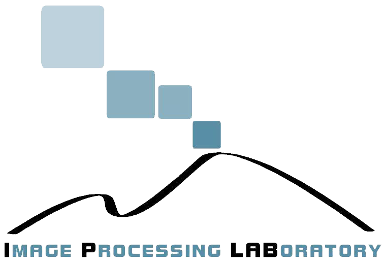

  

 
<h1  style="font-family: Arial;  font-size: 40px;"><b>Computational data analysis for first quantization estimation on JPEG double compressed images</b></h1>  

 
<b><a href="https://www.micc.unifi.it/icpr2020/" target="_blank">In Proceedings of the International Conference on Pattern Recognition</a></b> 
  

<b>Sebastiano Battiato1,2, Oliver Giudice2,3, Francesco Guarnera1,2, Giovanni Puglisi4</b> 
 
<b>1</b> <em>Department of Mathematics and Computer Science, University of Catania, Viale Andrea Doria 6, Catania 95125, Italy</em> 
	<b>2</b> <em>iCTLab s.r.l. Spinoff of University of Catania, Italy</em> 
	<b>3</b> <em>Banca d'Italia, Rome, Italy</em> 
	<b>4</b> <em>Department of Mathematics and Computer Science, University of Cagliari, Via Ospedale 72, Cagliari 09124, Italy</em> 
	  
	<b>battiato@dmi.unict.it, oliver.giudice@bancaditalia.it, francesco.guarnera@unict.it, puglisi@unica.it</b>
	  

<a href="https://ieeexplore.ieee.org/document/9412528"><b>DOWNLOAD PAPER</b></a>

  

	@article{battiato2021computational, 
title={Computational data analysis for first quantization estimation on JPEG double compressed images}, 
author={Battiato, Sebastiano and Giudice, Oliver and Guarnera, Francesco and Puglisi, Giovanni}, 
booktitle={2020 25th International Conference on Pattern Recognition (ICPR)}, 
pages={5951--5958} 
year={2021} 
organization = {IEEE} 
	}

  

